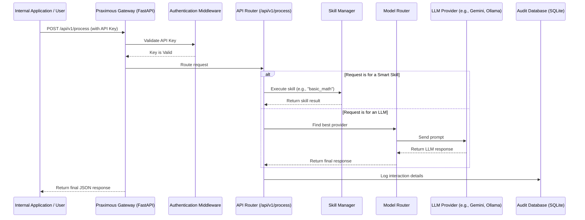

## Praximous Architectural Overview

Praximous is built on a modern, modular, and stateless architecture designed for security, scalability, and extensibility. This document provides a high-level overview of the core components and the data flow within the system, intended for technical decision-makers, architects, and developers.

## Core Design Principles

* **On-Premise First**: The entire system runs within your environment via Docker, ensuring your data never leaves your control.
* **Stateless by Design**: The backend API is stateless. Each request is self-contained, which simplifies scaling and improves reliability.
* **Pluggable and Extensible**: Key components like AI model providers and "Smart Skills" are designed to be pluggable, allowing for easy customization and extension without altering the core application.
* **Secure and Auditable**: All interactions are authenticated and logged, providing a complete audit trail for security and compliance.

## High-Level Architectural Diagram

The following diagram illustrates the flow of a typical request through the Praximous gateway.

## Key Components

### 1. API Gateway (FastAPI)

The heart of Praximous is a high-performance backend built with **FastAPI**. It is responsible for:

* Serving all API endpoints (e.g., `/api/v1/process`, `/api/v1/analytics`).
* Handling authentication and request validation.
* Serving the React-based Graphical User Interface (GUI).
* Managing WebSocket connections for real-time streaming to the GUI.

### 2. Configuration Layer

Praximous uses a layered configuration system to separate concerns:

* **`.env` file**: Stores secrets and environment-specific variables like API keys and database paths.
* **`config/identity.yaml`**: Defines the instance's persona, default behaviors, and system-level prompts.
* **`config/providers.yaml`**: A declarative file that defines all available AI model providers, their types (e.g., `gemini`, `ollama`), priorities for failover, and connection details.

### 3. Skill Execution Layer

This layer enables Praximous's core extensibility.

* **`SkillManager`**: On startup, this component automatically discovers and registers all valid "Smart Skills" located in the `skills/` directory.
* **`BaseSkill`**: An abstract class that defines the contract for all skills. Every skill must inherit from `BaseSkill` and implement `get_capabilities()` and `execute()` methods. This ensures consistency and predictability.

### 4. Provider Abstraction Layer

This layer decouples Praximous from any specific AI model provider.

* **`ProviderManager`**: Reads `config/providers.yaml` and dynamically loads the necessary clients to communicate with each configured AI service.
* **`ModelRouter`**: The intelligent routing component. When a request for an LLM is made, the `ModelRouter` selects the best provider based on the priority defined in `providers.yaml`. If the primary provider fails, it automatically attempts to **failover** to the next available provider, ensuring high availability.

### 5. Auditing & Analytics Layer

Designed for enterprise-grade traceability and insight.

* **Centralized Logger**: A robust logging system that captures application events.
* **Audit Database (SQLite)**: A dedicated SQLite database (`praximous_audit.db`) that records every transaction made through the `/api/v1/process` endpoint. Each record includes the request ID, timestamp, task type, status, latency, and redacted request/response data. This data powers the `/api/v1/analytics` endpoint and the GUI dashboard.

### 6. Presentation Layer (GUI)

A user-friendly interface built with **React**.

* It communicates with the FastAPI backend via the API endpoints.
* Provides a "Chat" interface for submitting tasks, an analytics dashboard for visualizing usage, and a library for exploring available Smart Skills.
* Utilizes **WebSockets** for streaming LLM responses in real-time, providing a highly responsive user experience.

## Request Lifecycle: A Step-by-Step Example

Here’s what happens when a client sends a request to execute a task:

1. **Request Received**: The FastAPI server receives a `POST` request at `/api/v1/process`. The request includes an `X-API-Key` header and a JSON body specifying the `task_type` and `prompt`.
2. **Authentication**: A middleware dependency intercepts the request and validates the `X-API-Key` against the keys configured in the `.env` file. If invalid, a `401 Unauthorized` error is returned.
3. **Task Routing**: The API endpoint inspects the `task_type`.
    * **If `task_type` matches a Smart Skill** (e.g., `echo`, `basic_math`), the `SkillManager` is invoked to execute that skill's logic directly. The skill runs locally, performs its function, and returns a structured result.
    * **If `task_type` is for an LLM** (e.g., `default_llm_tasks`), the request is handed to the `ModelRouter`.
4. **Provider Selection (LLM only)**: The `ModelRouter` consults its list of configured providers (from `providers.yaml`) and selects the one with the highest priority (lowest number).
5. **Execution**:
    * **Smart Skill**: The skill's `execute()` method runs.
    * **LLM**: The `ProviderManager` uses the appropriate client to send the prompt to the selected external or local LLM provider. If this call fails, the `ModelRouter` catches the exception and retries with the next provider in the priority list.
6. **Auditing**: Once the execution is complete (whether successful or failed), a detailed record of the transaction is written to the SQLite audit database.
7. **Response Sent**: A standardized JSON object containing the status, result, and request ID is returned to the client.

## Deployment (Docker)

The entire Praximous application, including its Python environment and dependencies, is packaged into a single **Docker image**. The `docker-compose.yml` file orchestrates the deployment, managing:

* **Containerization**: Running the Praximous service in an isolated environment.
* **Port Mapping**: Exposing the application's port (e.g., 8000) to the host machine.
* **Volume Mounting**: Persisting the `config/` and `logs/` directories on the host machine, so that your configurations and audit data survive container restarts.

This container-based approach ensures a consistent, reproducible, and secure deployment in any environment.
